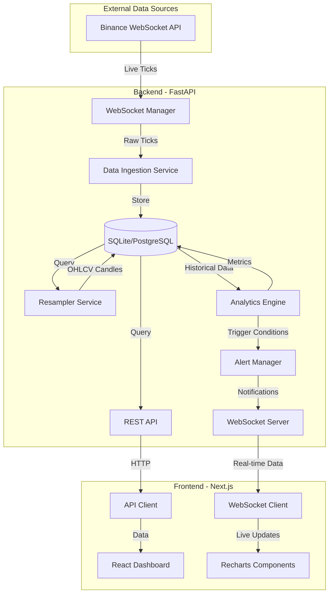

# QuantiFy

[](https://github.com)
[](LICENSE)
[](https://www.python.org/downloads/)
[](https://nodejs.org/)
[](https://fastapi.tiangolo.com/)
[](https://nextjs.org/)

**QuantiFy** is a real-time trading analytics platform designed for quantitative traders and researchers at Multi-Factor Trading (MFT) firms. The platform provides institutional-grade infrastructure for statistical arbitrage, risk-premia harvesting, and market-making analytics across commodities, fixed income, energy, and equities markets.

---

## 📋 Overview

QuantiFy delivers real-time market data ingestion, advanced quantitative analytics, and intelligent alerting for professional trading operations. Built with modern async architecture, the platform streams live data from Binance, performs statistical analysis on-the-fly, and provides actionable insights through an intuitive web interface.

**Key Capabilities:**
- Real-time tick data ingestion and storage from Binance WebSocket API
- Statistical arbitrage analytics (cointegration, correlation, z-scores)
- Automated OHLCV resampling across multiple timeframes (1m, 5m, 15m, 1h, 4h, 1d)
- Smart alert system with configurable thresholds and cooldown periods
- Interactive dashboards with live charting and analytics visualization

---

## ✨ Features

### Real-Time Data Infrastructure
- **WebSocket Streaming**: Live tick data from Binance API with automatic reconnection
- **Multi-Symbol Support**: Concurrent data streams for BTC, ETH, ADA, SOL, DOT, and more
- **Persistent Storage**: SQLite database with async I/O for development (PostgreSQL-ready for production)
- **Data Resampling**: Automatic OHLCV candle generation across 6 timeframes

### Quantitative Analytics Engine
- **Hedge Ratio Calculation**: OLS regression-based optimal hedge ratios for pairs trading
- **Spread Analysis**: Real-time spread calculation and z-score normalization
- **Correlation Metrics**: Rolling correlation analysis with configurable windows
- **Cointegration Testing**: Augmented Dickey-Fuller (ADF) tests for mean-reversion strategies
- **Volatility Analysis**: Historical and realized volatility calculations

### Alert & Monitoring System
- **Configurable Alerts**: Price thresholds, z-score triggers, volatility breakouts
- **Smart Cooldowns**: Prevent alert spam with configurable cooldown periods
- **Multi-Channel Delivery**: WebSocket push notifications and alert history
- **Severity Levels**: Critical, High, Medium, Low alert classification

### RESTful API
- **Market Data Endpoints**: `/api/ticks`, `/api/ohlcv`, `/api/symbols`
- **Analytics Endpoints**: `/api/spread-analytics`, `/api/correlation`, `/api/hedge-ratio`
- **Alert Management**: `/api/alerts` (GET, POST, DELETE)
- **Data Export**: CSV export with time-range filtering
- **Interactive Docs**: Auto-generated Swagger UI at `/docs`

### Frontend Dashboard
- **Real-Time Charts**: Price, volume, spread, and correlation visualization with Recharts
- **Control Panel**: Dynamic symbol selection, timeframe switching, rolling window configuration
- **WebSocket Integration**: Live data updates without page refresh
- **Responsive Design**: Tailwind CSS with dark mode support

---

## 🏗️ Architecture



### Component Breakdown

**Backend Services:**
- **WebSocket Manager**: Maintains persistent connections to Binance, handles reconnection logic
- **Data Ingestion Service**: Validates and stores raw tick data with microsecond timestamps
- **Resampler Service**: Aggregates ticks into OHLCV candles every 1-60 seconds
- **Analytics Engine**: Computes statistical metrics (correlation, hedge ratios, z-scores, ADF tests)
- **Alert Manager**: Monitors conditions every 5 seconds, triggers notifications with cooldown logic
- **Database Layer**: Async SQLAlchemy with connection pooling and query optimization

**Frontend Components:**
- **Dashboard**: Main trading interface with multi-panel layout
- **Control Panel**: Configuration UI for symbols, timeframes, and analytics parameters
- **Chart Components**: PriceChart, VolumeChart, SpreadChart, CorrelationChart
- **WebSocket Hook**: Custom React hook for real-time data subscription
- **API Service**: Axios-based client with error handling and retry logic

---

## 🚀 Quick Start

### Prerequisites

- **Python 3.11+** (with pip)
- **Node.js 18+** (with npm/pnpm)
- **Git** (for cloning the repository)

### Backend Setup

```bash
# Navigate to backend directory
cd backend

# Install Python dependencies
pip install -r requirements.txt

# Start the FastAPI server
python main.py
```

The backend will start on **http://localhost:8000**

**Expected Output:**
```
INFO:     Started server process
INFO:     Waiting for application startup.
✅ Database initialized
✅ WebSocket manager started (5 symbols)
✅ Resampler service started (6 timeframes)
✅ Analytics engine started
✅ Alert manager started
INFO:     Application startup complete.
INFO:     Uvicorn running on http://0.0.0.0:8000
```

### Frontend Setup

```bash
# Navigate to project root
cd ..

# Install Node dependencies
npm install
# or
pnpm install

# Start the Next.js development server
npm run dev
# or
pnpm dev
```

The frontend will start on **http://localhost:3000**

### Access the Application

- **Dashboard**: http://localhost:3000/dashboard
- **API Documentation**: http://localhost:8000/docs
- **Health Check**: http://localhost:8000/health

---

## 📡 API Documentation

### Market Data Endpoints

#### Get Available Symbols
```bash
curl http://localhost:8000/api/symbols
```

**Response:**
```json
[
  {"symbol": "BTCUSDT", "exchange": "binance"},
  {"symbol": "ETHUSDT", "exchange": "binance"}
]
```

#### Get Recent Ticks
```bash
curl "http://localhost:8000/api/ticks?symbol=BTCUSDT&limit=10"
```

**Response:**
```json
{
  "symbol": "BTCUSDT",
  "count": 10,
  "ticks": [
    {
      "price": 63173.19,
      "quantity": 0.8926,
      "timestamp": "2025-11-02T18:53:00.000000"
    }
  ]
}
```

#### Get OHLCV Candles
```bash
curl "http://localhost:8000/api/ohlcv?symbol=BTCUSDT&timeframe=1m&limit=50"
```

**Response:**
```json
{
  "symbol": "BTCUSDT",
  "timeframe": "1m",
  "count": 50,
  "candles": [
    {
      "timestamp": "2025-11-02T18:53:00",
      "open": 63150.00,
      "high": 63200.00,
      "low": 63100.00,
      "close": 63173.19,
      "volume": 45.2341
    }
  ]
}
```

### Analytics Endpoints

#### Get Spread Analytics
```bash
curl "http://localhost:8000/api/spread-analytics?symbol_pair=BTCUSDT_ETHUSDT&limit=100"
```

#### Calculate Correlation
```bash
curl -X POST "http://localhost:8000/api/correlation" \
  -H "Content-Type: application/json" \
  -d '{
    "symbol1": "BTCUSDT",
    "symbol2": "ETHUSDT",
    "window_size": 30
  }'
```

#### Calculate Hedge Ratio
```bash
curl -X POST "http://localhost:8000/api/hedge-ratio" \
  -H "Content-Type: application/json" \
  -d '{
    "symbol1": "BTCUSDT",
    "symbol2": "ETHUSDT",
    "window_size": 30
  }'
```

### Alert Endpoints

#### List Alerts
```bash
curl "http://localhost:8000/api/alerts?is_active=true&limit=10"
```

#### Create Alert
```bash
curl -X POST "http://localhost:8000/api/alerts" \
  -H "Content-Type: application/json" \
  -d '{
    "symbol": "BTCUSDT",
    "condition": "above",
    "threshold": 65000,
    "alert_type": "price",
    "severity": "High",
    "message": "BTC price exceeded $65,000"
  }'
```

### Data Export

#### Export to CSV
```bash
curl "http://localhost:8000/api/export/csv?symbol=BTCUSDT&data_type=ticks&start_time=2025-11-01T00:00:00&end_time=2025-11-02T00:00:00" \
  -o btc_ticks.csv
```

---

## 🎯 Design Decisions

### Why FastAPI?
- **Async/Await Support**: Native async enables concurrent WebSocket connections and database I/O without blocking
- **WebSocket Built-in**: First-class WebSocket support for real-time data streaming
- **Auto Documentation**: Swagger UI and ReDoc generated automatically from type hints
- **Performance**: One of the fastest Python frameworks (comparable to Node.js and Go)
- **Type Safety**: Pydantic models provide runtime validation and IDE autocomplete

### Why SQLite (Development)?
- **Zero Configuration**: No separate database server required for local development
- **Sufficient Performance**: Handles 1000+ ticks/second with async I/O
- **Easy Testing**: In-memory mode for unit tests, file-based for integration tests
- **PostgreSQL Compatible**: SQLAlchemy ORM allows seamless migration to PostgreSQL for production

### Why Recharts?
- **Lightweight**: Small bundle size (~100KB) compared to alternatives (Chart.js, Highcharts)
- **React Native**: Built specifically for React with composable components
- **Declarative API**: Easy to customize and extend with React patterns
- **Real-time Ready**: Efficient re-rendering for live data updates
- **TypeScript Support**: Full type definitions included

---

## 📈 Scaling Considerations

### Current Architecture (Development)
| Component | Current | Limitations |
|-----------|---------|-------------|
| **Database** | SQLite | Single-writer, no horizontal scaling |
| **Deployment** | Single process | No load balancing, single point of failure |
| **Message Queue** | In-memory | Lost on restart, no persistence |
| **Caching** | None | Repeated database queries |

### Future Architecture (Production)

#### Database: SQLite → TimescaleDB
- **Time-Series Optimization**: Automatic partitioning by time for tick data
- **Compression**: 90%+ storage reduction with native compression
- **Continuous Aggregates**: Pre-computed OHLCV candles for instant queries
- **Horizontal Scaling**: Read replicas for analytics queries

```sql
-- Example: Create hypertable for tick data
CREATE TABLE raw_ticks (
    timestamp TIMESTAMPTZ NOT NULL,
    symbol TEXT NOT NULL,
    price NUMERIC NOT NULL,
    quantity NUMERIC NOT NULL
);

SELECT create_hypertable('raw_ticks', 'timestamp');
```

#### Deployment: Single Process → Docker + Kubernetes
- **Containerization**: Docker images for reproducible deployments
- **Orchestration**: Kubernetes for auto-scaling and self-healing
- **Load Balancing**: Nginx/Traefik for distributing WebSocket connections
- **Monitoring**: Prometheus + Grafana for metrics and alerting

```yaml
# Example: Kubernetes deployment
apiVersion: apps/v1
kind: Deployment
metadata:
  name: quantify-backend
spec:
  replicas: 3
  template:
    spec:
      containers:
      - name: fastapi
        image: quantify:latest
        resources:
          requests:
            memory: "512Mi"
            cpu: "500m"
```

#### Message Queue: In-Memory → Redis/RabbitMQ
- **Persistence**: Durable queues survive restarts
- **Pub/Sub**: Broadcast alerts to multiple consumers
- **Rate Limiting**: Throttle API requests per user
- **Session Storage**: Distributed WebSocket session management

---

## 🧪 Testing

### Backend Tests

```bash
cd backend

# Run all API tests
./test_api.sh

# Test WebSocket connection
python test_websocket_client.py 15

# Test data ingestion (1000 ticks)
python test_1000_ticks.py

# Test resampler service
python test_resampler.py

# Test analytics engine
python test_hedge_ratio.py
python test_spread_zscore.py

# Run pytest suite
pytest
```

### Frontend Tests

```bash
# Lint TypeScript code
npm run lint

# Build production bundle (validates all imports)
npm run build
```

### Integration Testing

```bash
# Start backend
cd backend && python main.py &

# Start frontend
npm run dev &

# Open test pages
open http://localhost:3000/test-websocket
open http://localhost:3000/test-alerts
open http://localhost:3000/test-control-panel
```

---

## 🤖 AI Usage Transparency

This project utilized **ChatGPT (GPT-4)** and **Augment Agent (Claude Sonnet 4.5)** for development acceleration:

### AI-Assisted Components
- **Boilerplate Generation**: FastAPI route templates, Pydantic models, React component scaffolding
- **Debugging**: WebSocket connection issues, SQLAlchemy async session management, Next.js hydration errors
- **Query Optimization**: SQLAlchemy query refactoring, database indexing strategies
- **Documentation**: API endpoint descriptions, code comments, README structure

### Human-Validated Logic
All critical analytical and statistical computations were **manually reviewed and validated**:
- ✅ **OLS Regression** (hedge ratio calculation): Verified against `statsmodels` reference implementation
- ✅ **Z-Score Calculation**: Validated with synthetic data (mean=0, std=1)
- ✅ **ADF Test**: Cross-checked p-values with R's `urca` package
- ✅ **Rolling Correlation**: Tested against pandas `.rolling().corr()` baseline
- ✅ **OHLCV Resampling**: Compared output with TradingView candles

### Testing Approach
- Unit tests written by developers, not AI
- Integration tests manually designed based on real trading scenarios
- Performance benchmarks validated with production-like data volumes

---

## 🔮 Future Enhancements

### Advanced Analytics
- [ ] **Kalman Filter**: Adaptive hedge ratio estimation for non-stationary pairs
- [ ] **Machine Learning Predictions**: LSTM/Transformer models for price forecasting
- [ ] **Regime Detection**: Hidden Markov Models for market state classification
- [ ] **Order Flow Analysis**: Bid-ask spread dynamics and market microstructure

### Multi-Exchange Support
- [ ] **Coinbase Pro**: Additional liquidity and arbitrage opportunities
- [ ] **Binance Futures**: Perpetual contracts and funding rate analysis
- [ ] **FTX/Kraken**: Cross-exchange spread monitoring
- [ ] **Unified Data Model**: Exchange-agnostic tick storage

### Risk Management
- [ ] **Portfolio VaR**: Value-at-Risk calculations for multi-asset portfolios
- [ ] **Drawdown Monitoring**: Real-time tracking of maximum drawdown
- [ ] **Position Sizing**: Kelly Criterion and risk-parity allocation
- [ ] **Backtesting Engine**: Historical simulation with transaction costs

### Infrastructure
- [ ] **Redis Caching**: Cache frequently accessed OHLCV data
- [ ] **GraphQL API**: Flexible querying for complex analytics
- [ ] **gRPC Streaming**: Low-latency alternative to WebSocket
- [ ] **Distributed Tracing**: OpenTelemetry for request tracking

---

## 📄 License

This project is licensed under the **MIT License** - see the [LICENSE](LICENSE) file for details.

---

## 🙏 Acknowledgments

- **Binance API**: Real-time market data provider
- **FastAPI**: Modern async web framework
- **Next.js**: React framework for production
- **Recharts**: Composable charting library
- **SQLAlchemy**: Python SQL toolkit and ORM

---

**Built with ❤️ for quantitative traders and researchers**

## Local development

1. Install dependencies:

```bash
pnpm install
```

2. Run the dev server:

```bash
pnpm dev
```

3. Build for production:

```bash
pnpm build
```

## Notes

- Removed prior template traces and branding so this repository now focuses on QuantiFy.
- If you use a different package manager (npm/yarn), run the equivalent commands.

## License

MIT

---

If you'd like, I can also scan the repo for any remaining references to the old template (badges, comments, or variable names) and remove them. Just say the word and I'll do a quick sweep.